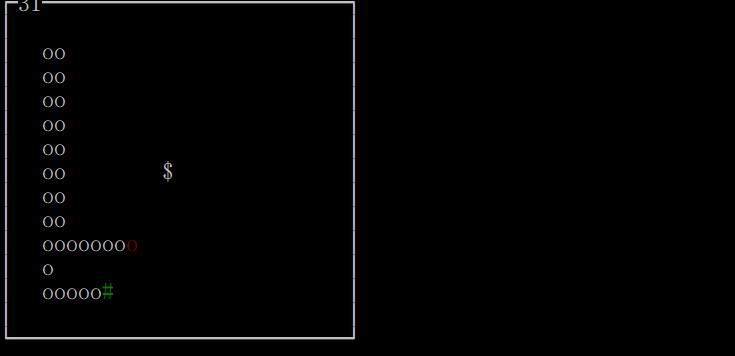

# Snake AI - 贪吃蛇 AI

## 简图



## 用法

### 基本用法

按键 “q” 进行退出。

```python
python snake.py
```

### 手动控制

> 以下代码都是在 main 函数里面修改

```pyathon
mysnake = Snake([30, 15])	# 30, 15 is the window size, default 40, 40
mysnake.begin()
```

### AI 控制

```python
mysnake = Snake()
mysnake.begin(useAI=True, interval=10)	# interval is time interval for refreshing, default 100 ms
```

### Debug

```python
# or just use the "mysnake.board"
board = [20, 10]
# positions of the snake, from head to tail
snake = [
	[18, 3], [18, 4], [17, 4], [16, 4]
]
food = [2, 3]
# get the path
path = BFS(board, snake, food)
print(path)
# draw in the board
snake.append(food)
mysnake.create(interval=100, arrays=snake)
```

## 策略

我先是自己用 BFS 进行搜索，然后总得不到好一点的结果，动不动就没路。综合参考的那几篇文章，知晓基本上比较低级的 AI 逻辑如下，这也是这个代码里面用到的：

* 如果蛇到食物之间有路径，而且吃了食物之后还能有到尾巴的路径，那么就按蛇到食物之间的路径移动一步。这里面有个关键点就是路径是最短路径。
* 如果上一步不行。
  + 如果蛇能找到到尾巴的路径，而且蛇到周围有效点后，也能找到到尾巴的路径，那么就按蛇到尾巴的路径移动一步。这里面的关键点是路径是最长路径。理想情况下蛇头周围有 3 个有效点，有 3 个路径。取这里面的最长路径。
* 如果前面 2 步都不行，进行 wander，走 S 形路径。

但是，目前还存在某些问题，AI 运行在后面，出现自己自闭到死一次，出现撞墙多次，尚不能完全走完。跑 [Hawstein](http://www.hawstein.com/posts/snake-ai.html) 的代码，在后期可能会追着尾巴循环到死，可惜不记得截图。所以总的来说还待改正，然而没地方下手::>_<::。

## References

* [戎码半生 - 浅析初等贪吃蛇AI算法](http://www.cnblogs.com/zhaoyu1995/p/5668495.html)
* [Hawstein - 如何用Python写一个贪吃蛇AI](http://www.hawstein.com/posts/snake-ai.html)
* [贪吃蛇 AI 的实现 snake AI](https://www.2cto.com/kf/201402/282140.html)