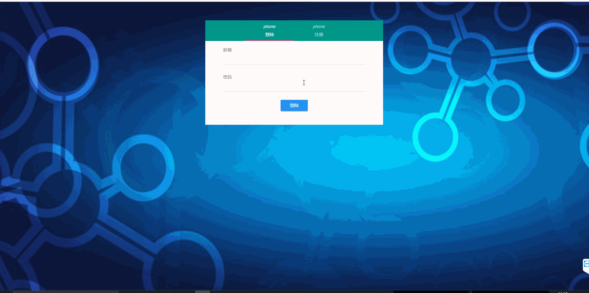

## Vue-Flask

A simple module for login/register by Vue and Flask which were developed seperately.

### Dependencies

* develop dependencies
  * npm
  * pip

* Front-end

| dependencies | version |
| ------------ | ------- |
| axios        | ^0.19.0 |
| muse-ui      | ^3.0.2  |
| vue          | ^2.5.2  |
| vue-axios    | ^2.1.4  |
| vue-router   | ^3.0.1  |
| vue-toasted  | ^1.1.27 |

* Back-end
  * python=3.7
  * flask-jwt-extended
  * flask-cors (unnessary when deployment)
  * python-dotenv

### Usage

1. clone this repos locally.
2. develop your front-end pages in front_end.

```shell
cd front_end
npm install
# Modify the code in `front_end` as you like.
# when all development is finished, do:
npm run build
# then you will got a file folder named dist
```

3. develop your back-end codes in back-end.

```shell
pip install pipenv
pipenv install
pipenv shell
# Do your back-end development
```

4. copy `front_end/dist/static` to `back_end/app/static`, and copy `front_end/dist/index.html` to `back_end/app/templates/index.html`
5. run `flask run` under `back_end`, and visit `http://127.0.0.1:5000/` , you can see:



